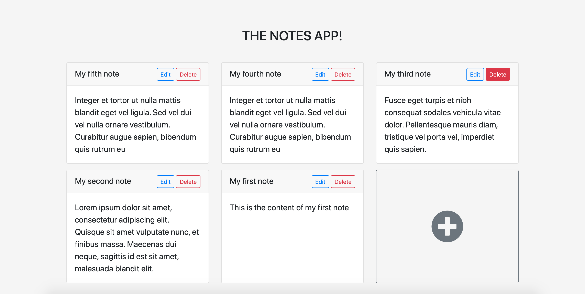
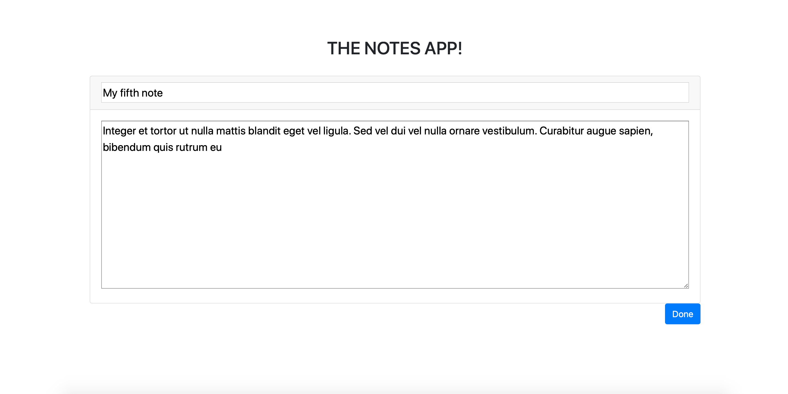

# Notes
A notes app based on Django, made solely for the purpose of learning Django.

Implementing basic features of adding, editing and deleting notes from a database. Single user system currently with no provision for login and personalisation.

### This is how the home page of the app looks like


### This is how the edit/add feature of the app looks like


### Running app on local
```
git clone https://github.com/mustafa1728/notes_app.git
cd notes_app
pip3 install -r requirements.txt
python manage.py runserver
```
